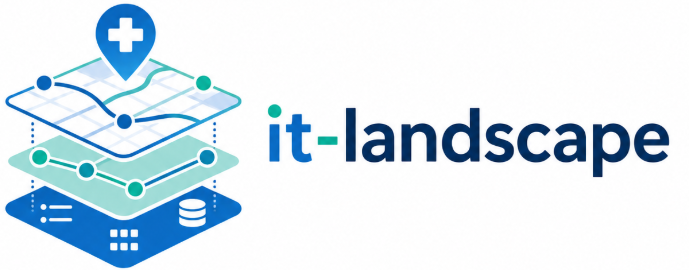

[](https://github.com/lquastana/it-landscape/actions/workflows/ci.yml)
[](LICENSE)
[](https://nextjs.org/)
[](docker-compose.yml)
[](lib/schemas)

MVP Next.js pour cartographier un système d'information hospitalier : applications, processus métier, serveurs, VLANs, flux applicatifs et impacts d'incident.


## Ce que fait le produit
- **Vue métier** : lecture par établissements, domaines, processus et applications.
- **Vue applicative** : applications regroupées par trigramme avec serveurs associés.
- **Vue réseau** : VLANs, réseaux, passerelles et serveurs par établissement.
- **Vue flux** : source, cible, protocole, type de message et EAI.
- **Simulation d'incident** : recherche des impacts directs et indirects d'un serveur, d'une application ou d'un flux indisponible.
- **Administration** : édition des référentiels JSON, imports Excel, gestion des trigrammes et habilitations.
- **Sécurité MVP** : authentification NextAuth, rôles `viewer` / `editor` / `admin`, audit append-only JSONL des écritures et exports.

## Aperçu

<details>
<summary>Voir les captures animées</summary>

### Flux applicatifs


### Infrastructure applicative


### Réseau


### Simulation d'incident


</details>

## Données
- `data/*.json` : vue fonctionnelle.
- `data/*.infra.json` : inventaire serveurs.
- `data/*.network.json` : VLANs et réseaux.
- `data/*.flux.json` : flux applicatifs.
- `data/trigrammes.json` : dictionnaire trigramme vers application.
- `data/auth/access-rules.json` : comptes de démonstration avec mots de passe hachés.
- `data/auth/auth-config.json` : règles de protection UI/API.
- `data/audit-log.jsonl` : journal local non versionné des actions auditées.

## Démarrage rapide

```bash
npm install
npm run dev
```

Application : http://localhost:3000

Avec Docker :

```bash
cp .env.example .env
docker compose up -d --build
```

Avec NetBox intégré :

```bash
cp .env.example .env
docker compose --profile netbox up -d --build
node scripts/netbox-seed.js
```

Avec `make` :

```bash
make dev
make docker
make docker-netbox
make docker-stop
```

Raccourcis disponibles :
- `make dev` : demarrage local `npm run dev`
- `make docker` : stack Docker applicative
- `make docker-netbox` : stack Docker avec profil NetBox
- `make docker-stop` : arret de la stack Docker

Voir la démo guidée : [docs/demo-5-minutes.md](docs/demo-5-minutes.md).

## Comptes de démonstration

Application web :

| Utilisateur | Mot de passe | Rôle |
|-------------|--------------|------|
| `viewer` | `password` | Lecture seule |
| `editor` | `password` | Lecture + écriture |
| `admin` | `password` | Administration complète |
| `valdellys` | `password` | Éditeur établissement |
| `dunes` | `password` | Éditeur établissement |
| `saintroch` | `password` | Éditeur établissement |

NetBox, si le profil Docker `netbox` est activé :

| Utilisateur | Mot de passe |
|-------------|--------------|
| `admin` | `password` |

> Warning production : ne jamais utiliser les comptes, mots de passe, tokens ou secrets par défaut en production.

## Secrets et environnements

Le modèle versionné est `.env.example`. Il sépare :
- les valeurs acceptables en développement local ;
- les secrets à remplacer en staging/production ;
- les variables optionnelles NetBox et Azure AD.

Bonnes pratiques :
- copier `.env.example` vers `.env` en local ;
- ne jamais commiter `.env`, `.env.local`, `.env.production` ou un token réel ;
- générer un `NEXTAUTH_SECRET` fort pour tout environnement partagé ;
- remplacer les comptes de démonstration dans `data/auth/access-rules.json` avant une mise en production ;
- activer Azure AD ou un fournisseur d'identité d'entreprise pour la production.

## RBAC et audit

Rôles :
- `viewer` : lecture seule ;
- `editor` : lecture + écriture sur les données ;
- `admin` : écriture, exports et gestion des habilitations.

Principales restrictions :

| Surface | Restriction |
|---------|-------------|
| `/` | Public |
| `/applications`, `/flux`, `/network`, `/incident` | `viewer+` |
| `/admin-*` | `editor+` |
| `/admin-habilitations` | `admin` |
| `GET /api/export` | `admin` |
| `POST /api/file/[name]` | `editor+` |
| `GET/POST /api/admin/roles` | `admin` |

Les écritures et exports alimentent `data/audit-log.jsonl`.

## NetBox

Quand `NETBOX_URL` et `NETBOX_TOKEN` sont définis, les endpoints infrastructure et réseau peuvent lire NetBox comme source de vérité. Le script `node scripts/netbox-seed.js` peuple NetBox depuis les JSON locaux pour une démonstration.

Mapping du trigramme applicatif, par priorité :
1. tag préfixé, par exemple `app:LAB` ;
2. tag court de trois caractères, par exemple `LAB` ;
3. custom field `trigramme`, `app_code` ou `application_code`.

## Tests

```bash
npm test
npm run build
```

Les tests couvrent la cohérence JSON, la configuration d'accès et les helpers RBAC/audit.

## Documentation
- [Positionnement produit](docs/product-positioning.md)
- [Démo en 5 minutes](docs/demo-5-minutes.md)
- [Architecture](docs/architecture.md)
- [Simulation d'incident](docs/incident-simulation.md)
- [Roadmap](docs/roadmap.md)
- [ADR stockage JSON](docs/adr/0001-data-storage-json.md)

## Licence

MIT. Voir [LICENSE](LICENSE).
