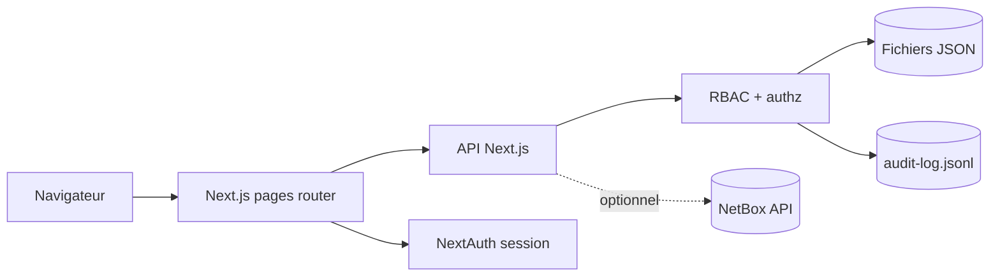

# Architecture

## Vue d'ensemble

## Composants

- **Frontend Next.js / React** : vues métier, applicative, flux, réseau, simulation d'incident et écrans admin.
- **API Next.js** : endpoints internes pour agréger les JSON, écrire les référentiels, exporter un snapshot et gérer les rôles.
- **Authentification** : NextAuth avec provider Credentials en développement et Azure AD possible en production.
- **Autorisation** : RBAC `viewer`, `editor`, `admin`, appliqué par middleware et helpers serveur.
- **Audit** : fichier append-only `data/audit-log.jsonl` pour tracer écritures, exports et changements d'habilitation.
- **Stockage MVP** : fichiers JSON versionnables sous `data/`, séparés par établissement et par vue.
- **NetBox optionnel** : source de vérité possible pour l'infrastructure et le réseau lorsque `NETBOX_URL` et `NETBOX_TOKEN` sont configurés.

## Flux de données

1. L'utilisateur se connecte via `/login`.
2. Le middleware vérifie la session et le rôle requis.
3. Les pages consomment les endpoints `/api/*`.
4. Les APIs lisent les JSON locaux ou NetBox selon la configuration.
5. Les opérations d'écriture passent par les endpoints admin et ajoutent une entrée d'audit.

## Surfaces principales

| Surface | Rôle minimal |
|---------|--------------|
| Vue métier `/` | Public |
| Vues consultation détaillées | `viewer` |
| Imports et éditions admin | `editor` |
| Habilitations et exports snapshot | `admin` |

## Limites assumées du MVP

- Pas encore de base de données applicative pour l'historisation fine.
- Audit append-only local, pas encore expédié vers un SIEM.
- Multi-tenant logique par données et rôles, pas encore cloisonnement fort par tenant.
- Les comptes de démonstration existent dans le référentiel local et doivent être remplacés avant production.

## Évolution cible

Le passage à une version industrialisée doit prioriser PostgreSQL, migrations de modèle, gestion de secrets externe, observabilité et durcissement du modèle d'autorisation.
