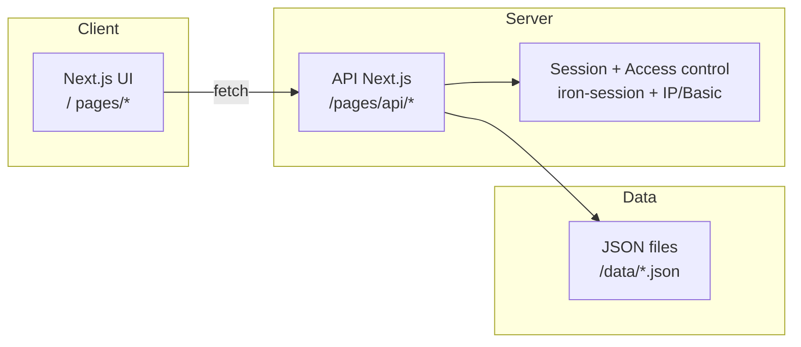

# Architecture

## Vue d'ensemble

## Composants principaux
- **UI Next.js** : vues métier, applicative, réseau, flux et simulation d’incident. Les pages consomment l’API interne et mettent en forme les données. 
- **API Next.js** : endpoints REST simples en lecture/écriture pour les JSON (`/api/landscape`, `/api/flux`, `/api/infrastructure`, `/api/file/*`).
- **Données** : fichiers JSON versionnables, séparés par établissement pour les vues métier, infra, réseau et flux.
- **Journal d'audit** : append-only JSONL pour tracer les écritures effectuées via l’API.
- **Sécurité d’accès** : session `iron-session` + filtrage IP/Basic Auth, appliqués sur les routes API sensibles.

## Flux de données (exemple)
1. L’utilisateur se connecte via `/login` (session).
2. Les pages demandent les données via `/api/*`.
3. Les APIs lisent/écrivent les fichiers JSON dans `/data`.

## Limites connues
- Modèle de données simple sans historisation en base.
- RBAC fin et audit non implémentés (à envisager si usage SI hospitalier).
