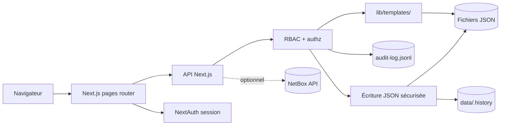
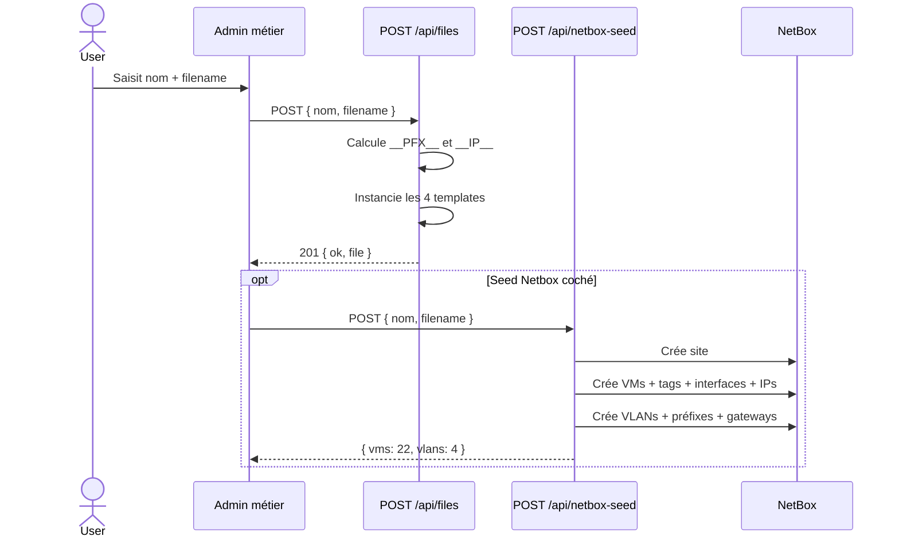

# Architecture

## Vue d'ensemble

```mermaid
flowchart LR
  Browser[Navigateur] --> UI[Next.js pages router]
  UI --> API[API Next.js]
  UI --> Auth[NextAuth session]
  API --> Guard[RBAC + authz]
  Guard --> Store[Écriture JSON sécurisée]
  Store --> JSON[(Fichiers JSON)]
  Store --> History[(data/.history)]
  Guard --> Audit[(audit-log.jsonl)]
  Guard --> Templates[lib/templates/]
  Templates --> JSON
  API -. optionnel .-> NetBox[(NetBox API)]
```

## Composants

- **Frontend Next.js / React** : vues métier, applicative, flux, réseau, qualité, simulation d'incident et écrans admin.
- **API Next.js** : endpoints internes pour agréger les JSON, écrire les référentiels, exporter un snapshot et gérer les rôles.
- **Authentification** : NextAuth avec provider Credentials en développement et Azure AD possible en production.
- **Autorisation** : RBAC `viewer`, `editor`, `admin`, appliqué par middleware et helpers serveur.
- **Audit** : fichier append-only `data/audit-log.jsonl` pour tracer écritures, exports et changements d'habilitation.
- **Stockage MVP** : fichiers JSON versionnables sous `data/`, séparés par établissement et par vue.
- **Écriture JSON sécurisée** : verrou par fichier, écriture atomique, historique `data/.history/history.jsonl` et snapshot du contenu précédent.
- **Templates de génération** (`lib/templates/`) : quatre templates JSON avec placeholders (`__NOM__`, `__PFX__`, `__PFX_UP__`, `__IP__`) instanciés à la création d'un établissement pour produire les fichiers métier, infra, réseau et flux.
- **NetBox optionnel** : source de vérité possible pour l'infrastructure et le réseau lorsque `NETBOX_URL` et `NETBOX_TOKEN` sont configurés. Le seed UI (`POST /api/netbox-seed`) crée site, VMs, IPs et VLANs depuis les JSON de l'établissement.

## Flux de données

1. L'utilisateur se connecte via `/login`.
2. Le middleware vérifie la session et le rôle requis.
3. Les pages consomment les endpoints `/api/*`.
4. Les APIs lisent les JSON locaux ou NetBox selon la configuration.
5. Les opérations d'écriture passent par les endpoints admin, écrivent les JSON de façon atomique, ajoutent une entrée d'historique technique et alimentent l'audit fonctionnel.

## Surfaces principales

| Surface | Rôle minimal |
|---------|--------------|
| Vue métier `/` | Public |
| Vues consultation détaillées : applications, flux, réseau, incident, qualité | `viewer` |
| Imports, éditions admin et réconciliation NetBox | `editor` |
| `POST /api/files` — création d'établissement (+ génération des 4 fichiers depuis templates) | `editor` |
| `POST /api/netbox-seed` — seed Netbox : site + VMs + IPs + VLANs + préfixes | `editor` |
| `DELETE /api/file/[name]` — suppression d'établissement (4 fichiers companions) | `admin` |
| Habilitations et exports snapshot | `admin` |

## Cycle de vie d'un établissement

```mermaid
sequenceDiagram
  actor User
  participant UI as Admin métier
  participant API as POST /api/files
  participant Seed as POST /api/netbox-seed
  participant NB as NetBox

  User->>UI: Saisit nom + filename
  UI->>API: POST { nom, filename }
  API->>API: Calcule __PFX__ et __IP__
  API->>API: Instancie les 4 templates
  API-->>UI: 201 { ok, file }
  opt Seed Netbox coché
    UI->>Seed: POST { nom, filename }
    Seed->>NB: Crée site
    Seed->>NB: Crée VMs + tags + interfaces + IPs
    Seed->>NB: Crée VLANs + préfixes + gateways
    Seed-->>UI: { vms: 22, vlans: 4 }
  end
```

## Limites assumées du MVP

- Pas encore de base de données applicative pour les transactions multi-fichiers et l'historisation requêtable.
- Audit append-only local, pas encore expédié vers un SIEM.
- Multi-tenant logique par données et rôles, pas encore cloisonnement fort par tenant.
- Les comptes de démonstration existent dans le référentiel local et doivent être remplacés avant production.

## Évolution cible

Le passage à une version industrialisée doit prioriser PostgreSQL, migrations de modèle, gestion de secrets externe, observabilité et durcissement du modèle d'autorisation.
